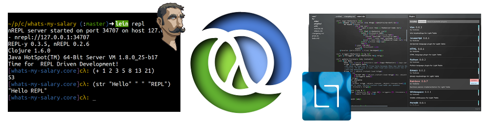

# Clojure, Practical.li

  This is an introduce to the Clojure programming language aimed at those just starting.  Clojure is presented in a simple to understand and highly practical way, so you can evaluate where Clojure is useful in your own projects.

> There are many excellent [books published on Clojure](reference/books.html) that go into detailed theory behind the language, so no need to repeat that here.

## Requirements 

If you wish to try out the Clojure code in this workshop, you will need the following:

  * A working Java runtime environment (JRE) - test with `java -version` in a command line window
  * [Leiningen](http://leiningen.org/) - test with `lein version` in a command line window
  * A Clojure aware editor with REPL
    - [LightTable](http://lighttable.com/)
    - [Emacs](http://www.gnu.org/software/emacs/) with either [Emacs Live](https://github.com/overtone/emacs-live), [Spacemacs](https://github.com/syl20bnr/spacemacs) or [CIDER](https://github.com/clojure-emacs/cider)
  * A [Git client](http://git-scm.com/) (optional)
  
  See the [setup](/setup/) section for details on how to get your environment ready

## Code for the workshop

The code for this workshop is contained in the Github repository [Clojure Examples](https://github.com/practicalli/clojure-example), the code for each section is in a specific branch.

To get a copy of the repository, use the following git clone command which creates a new directory called clojure-webapps-example that contains the cloned code. 

`git clone https://github.com/practicalli/clojure-example.git`

Once you have the repository, use `git checkout branch-name` to get the code for each section.  Each branch is a working application with all the features covered in that section

Use `git branch` to show all the branches available, they should match the names of the sections in this workshop.

Enjoy.

## Additional Resources

**Presentations**
* [Getting started with Clojure](http://jr0cket.co.uk/slides/getting-started-with-clojure.html)

**Clojure**
* [Clojure.org](http://clojure.org), [features](http://clojure.org/features) and [rational](http://clojure.org/rationale)
* [Clojure documentation](http://clojure.org/documentation)
* [Clojure cheetsheet](http://clojure.org/cheatsheet)
* [Official Google group](https://groups.google.com/forum/#!forum/clojure)
* [CrossClj](http://crossclj.info/) - cross-referencing the Clojure ecosystem

**Other Clojure Examples**
* [Clojure through code](https://github.com/practicalli/clojure-through-code) - sample code to evaluate in LightTable
* [Lighttable Koans](https://github.com/practicalli/lighttable-koans) - exercises to help you discover Clojure 
* [Brave Clojure](http://www.braveclojure.com/)
* [ClojureBridge curiculum](https://github.com/ClojureBridge/curriculum)
* [Clojure webapp sample](https://github.com/practicalli/clojure-webapp-sample) - hello world with Compojure
* [Getting started with Clojure on Heroku](https://github.com/jr0cket/clojure-getting-started)

**ClojureScript**
* [Etudes for Clojurescript](http://catcode.com/etudes-for-clojurescript) - exercises to complete
* [Secretary](https://github.com/gf3/secretary) - client side routing (think compojure for ClojureScript)
*  - build tool for ClojureScript

**Tooling**
* [Leiningen](http://leiningen.org/), [tutorial](https://github.com/technomancy/leiningen/blob/stable/doc/TUTORIAL.md), [faq](https://github.com/technomancy/leiningen/blob/stable/doc/FAQ.md), [plugins list](https://github.com/technomancy/leiningen/wiki/Plugins) & [sample project file](https://github.com/technomancy/leiningen/blob/stable/sample.project.clj)
* [LightTable](http://lighttable.com/), [docs](http://docs.lighttable.com/), [blog](http://www.lighttable.com/blog/), [announcements](https://groups.google.com/forum/#!forum/light-table) and [discussions](https://groups.google.com/forum/#!forum/light-table-discussion).
* [Emacs Live discussion group](https://groups.google.com/forum/#!forum/emacs-live)
* [Gorilla REPL](http://gorilla-repl.org/) - browser based REPL & tool for creating documents with live running Clojure code

**Community**
* [Clojure-docs](http://clojure-doc.org/) - community docs 
* [CrossCLJ](http://crossclj.info/) - cross-referencing the Clojure ecosystem
* [4Clojure](https://www.4clojure.com/) exercises & [4Clojure Google group](https://groups.google.com/forum/#!forum/4clojure)
* [London Clojurians]() and their [Google group](https://groups.google.com/forum/#!forum/london-clojurians)
* [Uncle Bob presents Clojure](https://www.youtube.com/watch?v=SYeDxWKftfA)

**Books & Tutorials**
* [Clojure cookbook](https://github.com/clojure-cookbook/clojure-cookbook)

**Music**
* [Overtone](https://github.com/overtone/overtone) - toolkit for designing synthesizers and collaborating with music
* [Meta-x/ignite](https://github.com/meta-ex/ignite) - live performance music & graphics

**Misc**
* [Lively Clojureschool](https://github.com/likely/clojure-school)
* [Lively projects](https://github.com/likely)

| Author | Date |
| -- | -- |
|John Stevenson | Fri 12 Dec 2014 13:58:09 GMT |
