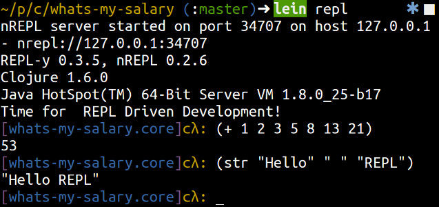

# Leiningen Build tool

Leiningen (pronounced line-i-gen) is a very powerful build automation tool.  With it you can:

* Create Clojure Projects
* Define and manage dependencies
* Run Clojure applications
* Run an interactive Clojure environment (REPL)
* etc.

> **Note** Install Leiningen and test it works

  Download the install script from [leiningen.org](http://leiningen.org/) and run the Leiningen script in a terminal

  On Linux and MacOSX, make the script executable first

    chmod a+x lein
    ./lein

  Test that Leiningen is installed with the following command

    lein version

  Output should look similar to:

    Leiningen 2.4.3 on Java 1.7.0_45 Java HotSpot(TM) 64-Bit Server VM

