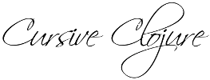

# Other Development tools for Clojure 

Clojure runs on the Java Virtual Machine so its not surprising that there is good support for Clojure in the major Java IDEs.  There is also a long history

## Emacs / Spacemacs

Emacs has always given great Clojure support and is a very powerfull tool for Clojure & Clojurescript development.

The easiest way to set Emacs up as a Clojure tool is to use [Spacemacs](http://spacemacs.org/) and add the Clojure layer to the `.spacemacs` file once Spacemacs has been installed.

> **Hint** View the [Spacemacs ABC video series](https://www.youtube.com/watch?v=ZFV5EqpZ6_s&list=PLrJ2YN5y27KLhd3yNs2dR8_inqtEiEweE&index=1) by [Eivind Fonn](https://www.youtube.com/channel/UC9FdDIWaFP-4fHuQ7bhIT1Q) on YouTube to learn all the amazing things that Emacs can do.

Recommended Emacs version 24.4 or any greater minor version (Emacs 25.x is a bit too new just yet - April 2016)

> On MacOSX, a really old version of emacs is installed by default (version 22.x).  If you run the Emacs App launcher this shoud not cause a problem, however you will have to rename or delete the exectuable if you want to run emacs from the command line.  Alternatively, create an ailas for emacs in your profie that points to the right version.

## NightCode

[Nightcode](https://sekao.net/nightcode/) is simple IDE for Clojure projects targeting the command line, the desktop, the web, and Android. It's just a standalone jar file that will run anywhere without being installed. Whether you choose to make a Clojure, ClojureScript, or Java project, Nightcode will use its built-in copy of Leiningen to build and run your code.

## Atom & Protorepl

The Atom editor has a plugin called [Protorepl](https://atom.io/packages/proto-repl) that provides a Clojure REPL.

## Sublime text

The Sublime text editor supports basic syntax highlighting of Clojure and could be used with a command line REPL, eg. using `lein repl`.  There have been Clojure REPL plugins for Sublime text, however these are not currently maintained.  Using Atom & Protorepl is the closest alternative.

## InteliJ

[Cursive](https://cursiveclojure.com/) is a Clojure IDE that aims to understands your code.  Advanced structural editing, refactorings, VCS integration and much more, all out of the box.  It is currently a standalone tool, although will eventually become an IntelliJ plugin.

## Eclipse

[Counterclockwise](https://code.google.com/p/counterclockwise/)

## Netbeans 

Netbeans did have great support for Clojure, but unfortunately at the time of writing the Clojure plugin has been unmaintained for so long it is not a viable tool to use for Cojure development.

